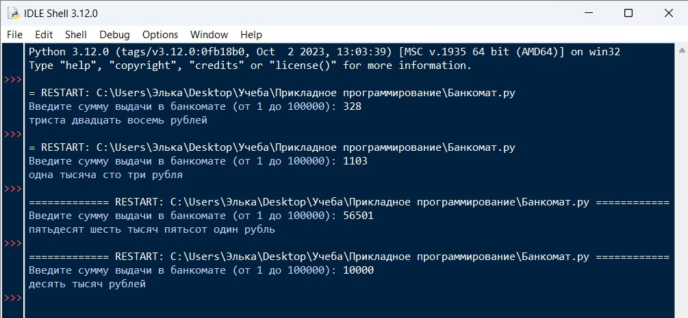

# Лабораторная №4

# Исполнитель
Громова Эльвира  
Группа ФТ-220007

# Задание
Операторы выбора if/else/case - Банкомат

Написать на любом языке программу: пользователь вводит число от 1 до 100 000 (сумму выдачи в банкомате). Необходимо вывести на экран словами введенную сумму и в конце написать название валюты (рубли) с правильным окончанием.  
Обеспечить надежность ПО (проверка ввода чисел)

Например: 7431 – семь тысяч четыреста тридцать один рубль, 2149 – две тысячи сто сорок девять рублей, 15 – пятнадцать рублей, 3 – три рубля.

# Среда разработки
Язык программирования: Python  
Среда разработки: IDLE

# Инструкция по работе
Перед запуском нужно установить модуль num2words (*).  
При открытии файла Банкомат.py необходимо ввести число, которые соответсвуют диапазону указанному в задании. Запустить программу, нажав ENTER. При выводе Вы увидите сумму написанную словами.

(*) Для установки модуля num2words вам необходимо выполнить следующую команду в командной строке (терминале):
pip install num2words

# Тесты
Выполнение программы для тестов: 328, 1103, 56501, 10000

